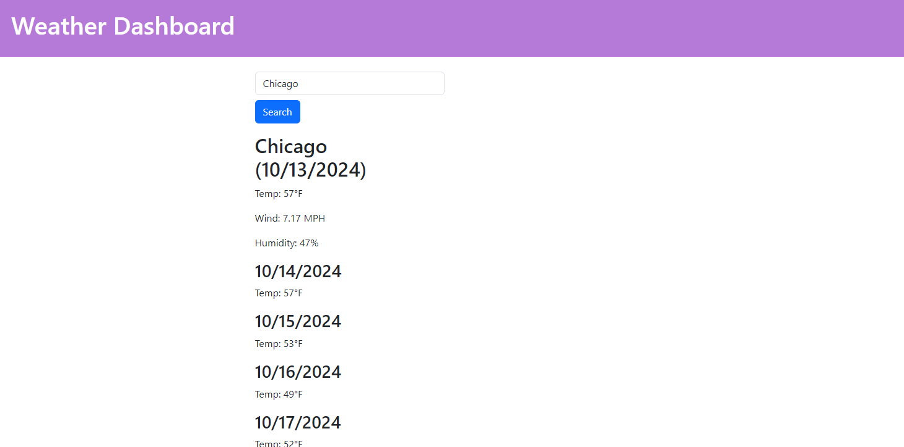

# Server-Side APIs: Weather Dashboard

## Description

The challenge is to build a Weather Dashboard that displays the current weather along with a 5-Day forecast. The application finds the weather for a specified city based on the user's input. The OpenWeatherMap Third-party API is used to find the data.

## User Story

```md
AS A traveler
I WANT to see the weather outlook for multiple cities
SO THAT I can plan a trip accordingly
```

## Acceptance Criteria

```md
GIVEN a weather dashboard with form inputs
WHEN I search for a city
THEN I am presented with current and future conditions for that city and that city is added to the search history
WHEN I view current weather conditions for that city
THEN I am presented with the city name, the date, an icon representation of weather conditions, the temperature, the humidity, and the wind speed
WHEN I view future weather conditions for that city
THEN I am presented with a 5-day forecast that displays the date, an icon representation of weather conditions, the temperature, the wind speed, and the humidity
WHEN I click on a city in the search history
THEN I am again presented with current and future conditions for that city
```
## Table of Contents
- [Technologies](#technologies)
- [Usage](#usage)
- [License](#license)
- [Example](#example)
- [Questions](#questions)

## Technologies
1. HTML
2. JavaScript
3. CSS
4. OpenWeatherMap API

## Usage
Follow these steps to run the application:
1. Open the application using the deployed link: https://ebaby-ak.github.io/weather-dashboard/
2. Search for your desired city
3. Current Weather and 5-Day Forecast will populate

## License
None


## Example
**Chicago Weather:**



## Questions
For any questions, please reach out at:
- [ebaby-ak](https://github.com/ebaby-ak)